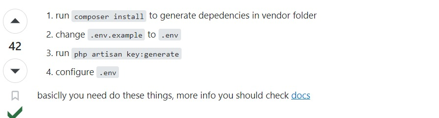

## Table Functions & Relations

Vehicle Tabel
- Data kendaraan 
- Relasi many-to-many dengan user dengan pivot tabel rentvehicle
	* berfungsi untuk mengetahui kendaraan mana yang di gunakan
- Relasi one-to-many dengan tabel maintenance
	* berfungsi untuk mengetahui kendaraan mana yang di servis

maintenance tabel
- Data service kendaraan dan keluhan
- Relasi dengan one-to-many dengan DetailMaintenance
	* berfungsi untuk mengetahui apa saja yang diservis dari kendaraan tersebut

detailmaintenance tabel
- data sparepart kendaraan dan yang diservice

workshop tabel
- data bengkel
- relasi one-to-many dengan maintenance
	* berfungsi untuk mengurangi data yang redundant

rentvehicle tabel
- Data peminjaman kendaraan
- memiliki dua jenis status peminjam (internal dan external)
- apabila internal maka tidak dikenakan biaya sewa dan tidak ada jaminan, berlaku sebaliknya untuk external
- Relasi one-to-many dengan tabel assurance
	* untuk menyimpan data jaminan yang diberikan ketika menyewa kendaraan

departement tabel
- data departement
- relasi one-to-many dengan user
	* untuk mengetahui asal departement dari user

user tabel
- Data karyawan

assurance tabel 
- Data jaminan dari setiap peminjaman external

customers table
- data konsumen
- relasi one-to-many dengan project
	* berfungsi untuk mengetahui pemilik project

project table
- data project
- relasi many-to-many dengan user dengan pivot table project assign
	* berfungsi untuk admin dapat menentukan karyawan bekerja disebuah project
- relasi many-to-many dengan user dengan pivot table project activity detail
	* berfungsi untuk mengetahui aktivitas atau timeline dari sebuah project

projectassign tabel
- menentukan anggota tim pengerjaan project oleh admin

projectactivitydetail
- activity dibuat oleh admin berdasarkan tabel project, detail dari project tersebut diisi oleh teknisi sesuai pelaksanaan dilapangan, dan masuk kedalam tabel ini
- relasi many-to-many dengan user dengan pivot table historyproject report
	* berfungsi untuk mengetahui riwayat assign dan perubahan terkait pengerjaan project
- relasi one-to-many dengan device
	* berfungsi untuk mengetahui perangkat yang dikerjakan pada aktivitas di sebuah project

historyprojectreport tabel
- data riwayat assign dan perubahan terkait pengerjaan project

device table
- data perangkat yang dikerjakan  

  
## After Cloning

Langkah-langkah setelah cloning, jalankan di project lokal:

Kemudian jalankan "composer require laravel/ui"
